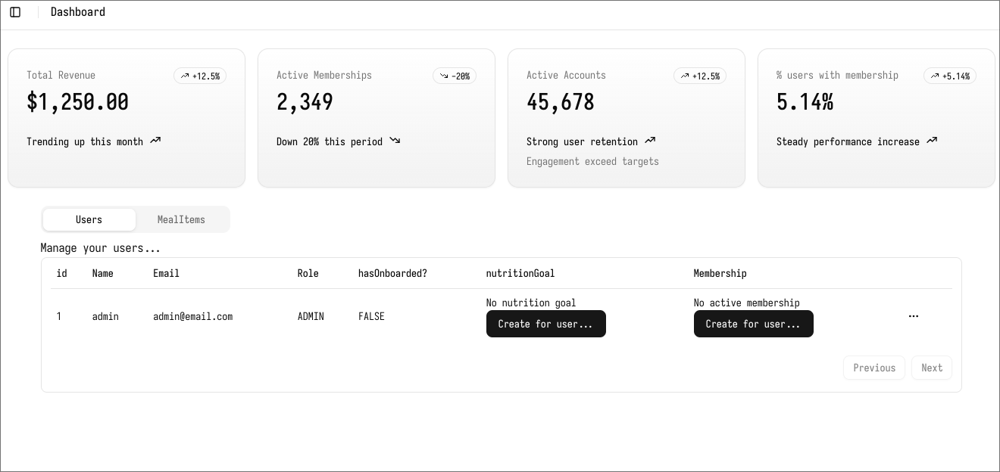
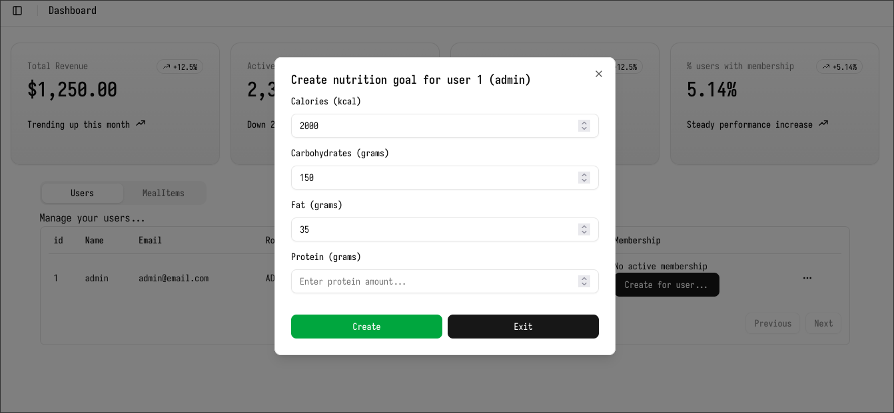
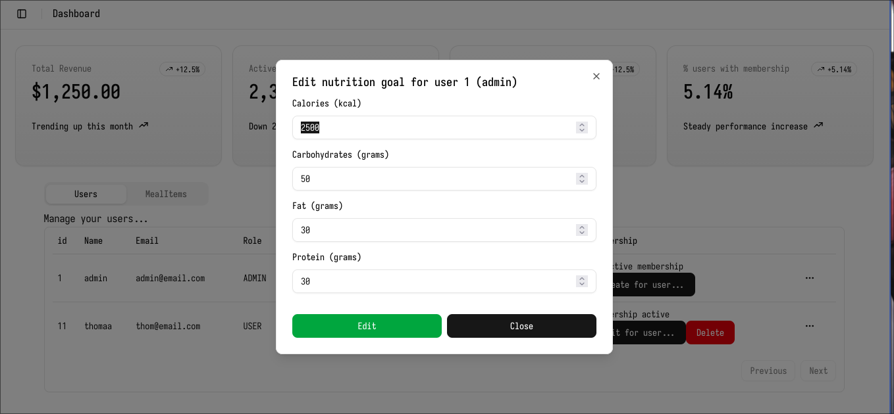
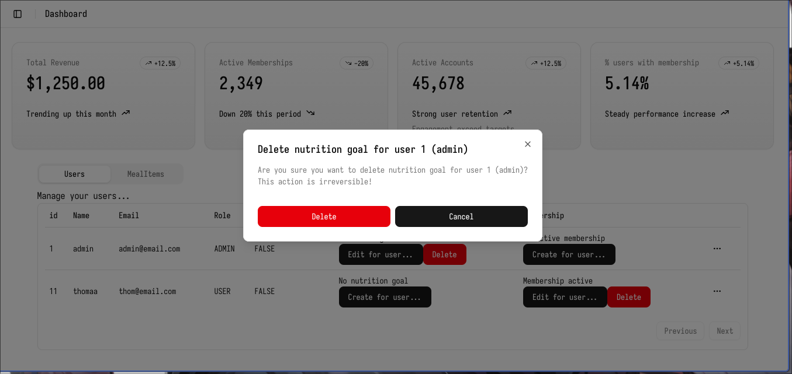
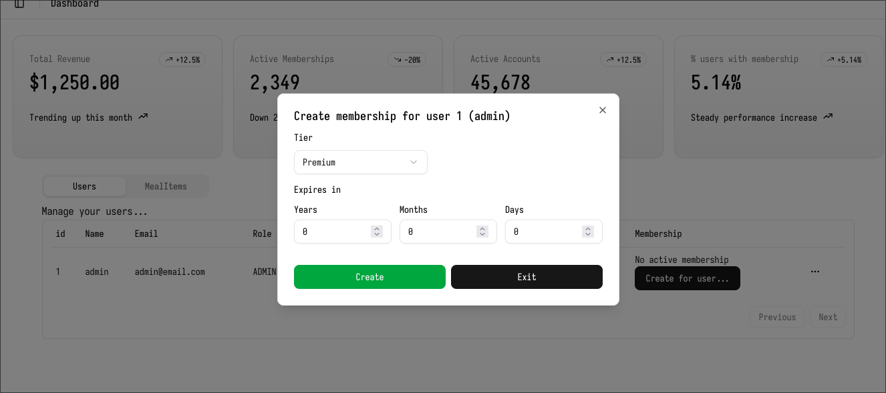
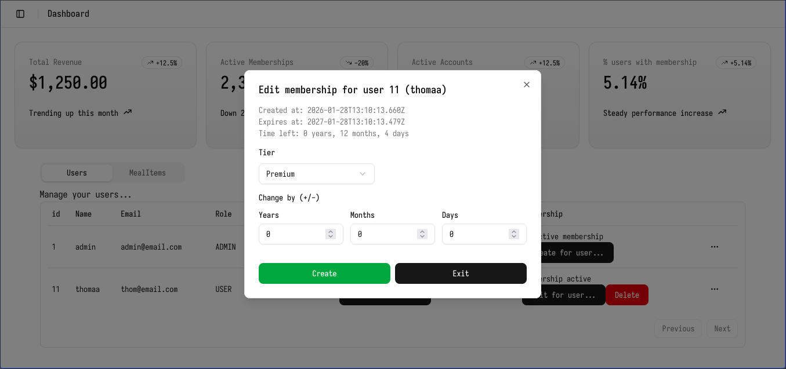

# PlatePal admin panel

Deployed with Vercel in [https://platepal-admin-panel.vercel.app](https://platepal-admin-panel.vercel.app)

For testing purpose, the following credentials can be used:

Email: admin@email.com

Password: admin1234

## Features
- Admin-only Access
- Manage users
- Create, Read, Update and Delete every users' nutrition goal
- Create, Read, Update and Delete every users' membership
- Table pagination
- Check revenue based on user membership


## KNOWN BUGS
- On request send, sometimes the page does not update automatically. Users need to manually refresh to update the page for now

## Tech Stack
- Next.js + TailwindCSS for Frontend
- shadcn/ui for UI components such as buttons, tables, modals, input fields
- Axios for API request


## Screenshots

### Dashboard



### Nutrition Goal CRUD





### Membership CRUD




This is a [Next.js](https://nextjs.org) project bootstrapped with [`create-next-app`](https://nextjs.org/docs/app/api-reference/cli/create-next-app).

## Getting Started

First, run the development server:

```bash
npm run dev
# or
yarn dev
# or
pnpm dev
# or
bun dev
```

Open [http://localhost:3000](http://localhost:3000) with your browser to see the result.

You can start editing the page by modifying `app/page.tsx`. The page auto-updates as you edit the file.

This project uses [`next/font`](https://nextjs.org/docs/app/building-your-application/optimizing/fonts) to automatically optimize and load [Geist](https://vercel.com/font), a new font family for Vercel.

## Learn More

To learn more about Next.js, take a look at the following resources:

- [Next.js Documentation](https://nextjs.org/docs) - learn about Next.js features and API.
- [Learn Next.js](https://nextjs.org/learn) - an interactive Next.js tutorial.

You can check out [the Next.js GitHub repository](https://github.com/vercel/next.js) - your feedback and contributions are welcome!

## Deploy on Vercel

The easiest way to deploy your Next.js app is to use the [Vercel Platform](https://vercel.com/new?utm_medium=default-template&filter=next.js&utm_source=create-next-app&utm_campaign=create-next-app-readme) from the creators of Next.js.

Check out our [Next.js deployment documentation](https://nextjs.org/docs/app/building-your-application/deploying) for more details.
